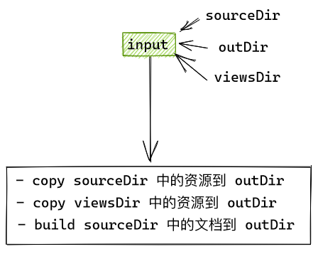

# OceanPress

将 MarkDown 文件转换为 html 的静态站点

[点击这里查看生成后的效果](https://siyuan-note.github.io/oceanpress/) 静态文件位于 [gh-pages](https://github.com/siyuan-note/oceanpress/tree/gh-pages)

[搭配 hexo 的效果](https://2234839.github.io/hexo-oceanpress/)

注意！思源1.2 存在一个比较大的改动，这之前的版本请使用 [siyuan-note/oceanpress at b6185cd79f](https://github.com/siyuan-note/oceanpress/tree/b6185cd79f0552698fad38b9ee7062c0abc3e1d7)

## 运行方式 run

[下载地址](https://github.com/siyuan-note/oceanpress/releases) 只需下载所用平台的二进制文件与 views.zip 就可以了


| 平台    | 命令                                      | 备注                         |
| --------- | ------------------------------------------- | ------------------------------ |
| Windows | `.\md2website-windows-4.0-amd64.exe 参数` |                              |
| Linux   | `.\md2website-linux-amd64 参数`           |                              |
| Mac     | `.\md2website-darwin-10.6-amd64 参数`     | 我没有尝试过，因为我没有 mac |
| 源码    | `go run .\src\ 参数`                      |                              |

### 参数


| 参数名          | 值                                                                           | 示例                                              |
| :---------------- | ------------------------------------------------------------------------------ | --------------------------------------------------- |
| SourceDir       | 是笔记所在目录                                                               | C:/Users/llej/Documents/SiYuan/data/note          |
| OutDir          | 是你要输出的目录                                                             | D:/code/doc/docHTML                               |
| viewDir         | 之前下载的 view.zip 解压后的目录，<br />可以自行修改其中的文件来定制一些效果 | ./views/                                          |
| SqlitePath      | 是思源生成的 db 文件的路径                                                   | C:/Users/llej/AppData/Local/Temp/siyuan/siyuan.db |
| RssNoOutputHtml | 对于后缀为.rss.xml的文档不输出对应的html                                     | true（默认值）                                    |

示例：

```bash
❯ ./md2website-windows-4.0-amd64.exe -SourceDir C:/Users/llej/Documents/SiYuan/data/note -OutDir D:/code/doc/docHTML -TemplateDir D:/code/oceanpress/src/views -SqlitePath C:/Users/llej/AppData/Local/Temp/siyuan/siyuan.db

# 运行输出

0. === 🛬 开始转换 🛫 ===
1. 用户输入
   1.1 sourceDir:C:\Users\llej\Documents\SiYuan\data\note
   1.2 outDir:D:\code\doc\docHTML
   1.3 viewsDir:D:\code\oceanpress\src\views
   1.4 dbPath:C:\Users\llej\AppData\Local\Temp\siyuan\siyuan.db
   1.5 AssetsDir:C:\Users\llej\Documents\SiYuan\data\assets
2. copy 资源到 outDir
   2.1 copy 完成
3. 生成 html
   3.1 收集转换生成所需数据
   3.2 复制资源文件
   3.3 从文件到数据结构转换完毕，开始生成html,共 293 项
   [warn] 未找到id 20210104102607-1rhjb41 对应的fileEntity
   [warn] 未找到id 20210511124801-bhveys4 对应的fileEntity
   ----- End -----

```

## 待完成的功能点（按优先级降序排序）


| 可用 | 功能名                                                                                                                                                                                                                                                                                                                             | 大致进度 |
| ------ | ------------------------------------------------------------------------------------------------------------------------------------------------------------------------------------------------------------------------------------------------------------------------------------------------------------------------------------ | ---------- |
| ✅   | [#6 内容块动态查询渲染](https://github.com/siyuan-note/oceanpress/issues/6)                                                                                                                                                                                                                                                        | `80%`    |
| ❎🔨 | [#4 菜单页面美化](https://github.com/siyuan-note/oceanpress/issues/4)                                                                                                                                                                                                                                                              | `15%`    |
| ✅🔨 | [#2 嵌入块渲染](https://github.com/siyuan-note/oceanpress/issues/2) 目前不支持循环引用                                                                                                                                                                                                                                             | `60%`    |
| ⭕   | 目录树                                                                                                                                                                                                                                                                                                                             |          |
| ⭕   | 页面 header 与 footer                                                                                                                                                                                                                                                                                                              |          |
| ⭕   | 块引用当前页面预览                                                                                                                                                                                                                                                                                                                 |          |
| ⭕   | 块链接可 copy                                                                                                                                                                                                                                                                                                                      |          |
| ⭕   | 书签页                                                                                                                                                                                                                                                                                                                             |          |
| ⭕   | 标签页                                                                                                                                                                                                                                                                                                                             |          |
| ✅🔨 | [#8 反链](https://github.com/siyuan-note/oceanpress/issues/8)                                                                                                                                                                                                                                                                      | `50%`    |
| ✅🔨 | [#1 块引用链接](https://github.com/siyuan-note/oceanpress/issues/1)                                                                                                                                                                                                                                                                | `92%`    |
| ❌   | 支持 {.text} 这样的锚文本。<br />思源1.2后已经不再支持                                                                                                                                                                                                                                                                             | `100%`   |
| ✅   | [#3 代码高亮 以及 数学公式和脑图等渲染](https://github.com/siyuan-note/oceanpress/issues/3) [点击这里查看生成后的效果](https://siyuan-note.github.io/oceanpress/Markdown%20%e4%bd%bf%e7%94%a8%e6%8c%87%e5%8d%97/3%20%e5%ae%8c%e6%95%b4%e7%a4%ba%e4%be%8b.html)<br />还需要修改 vditor 等资源的引用为本地文件（不是很重要之后再说） | `100%`   |

1. ✅ 表示基本可以使用了
2. 🔨 表示还在修改中
3. ❎ 表示有一小部分功能可以使用了但还存在比较大的问题
4. ❌ 表示不可用
5. ⭕ 表示尚未开始

## 相关

### 使用本产品的网站

> 欢迎您向我[提交您的网站地址](mailto:admin@shenzilong.cn)，我将在审阅后添加到此处

- [崮生 • 一些随笔 🎨](https://shenzilong.cn)

## 开发



### 渲染

- 自定义渲染器在 ./src/render/ocean_press_render_custom.go 下
  - render 目录下的其他文件均是从 lute 项目中 copy 过来的

### /front-end-lib

> 这个目录下是一个使用 svelte 的前端项目，目的是为了提供前端技术上的支持

这个项目主要的思路是提供自定义组件的 js 文件，然后在 html 的模板中就直接使用自定义组件的标签了，这样方便用户替换其中的一些实现。

目前生成的资源有：


| js 文件                                                                                            | 描述                                              | 体积  |
| ---------------------------------------------------------------------------------------------------- | --------------------------------------------------- | ------- |
| [all_components](./src/views/assets/front-end-lib/all_components.js)                               | 包含了所有组件                                    | 266KB |
| [block-ref.web_components](./src/views/assets/front-end-lib/block-ref.web_components.js)           | 块引用组件                                        | 4KB   |
| [embedded-block.web_components](./src/views/assets/front-end-lib/embedded-block.web_components.js) | 嵌入块组件                                        | 5KB   |
| [md.web_components.js](./src/views/assets/front-end-lib/md.web_components.js)                      | 文档渲染组件<br/>因为引入了 vditor 所以稍微有点大 | 263KB |

默认引入 all_components.js

### build

`go build -o md2website.exe .\src\`

```
RssNoOutputHtml
```
