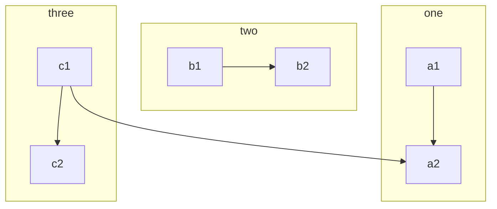
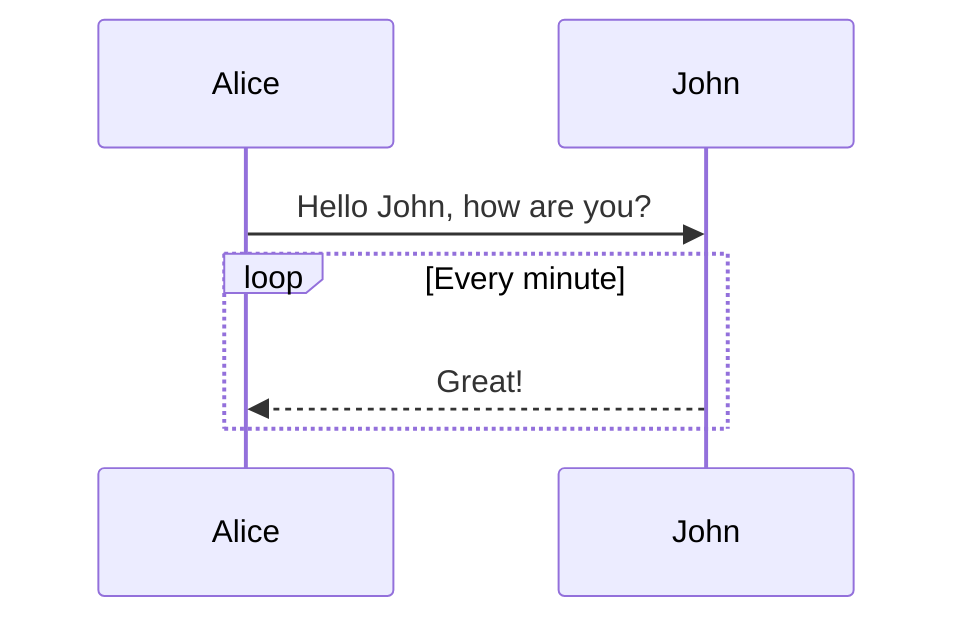
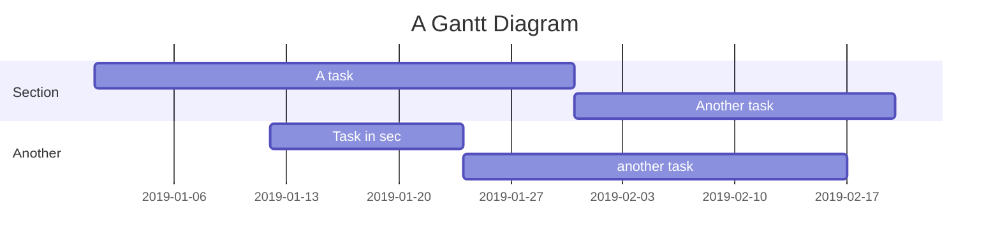
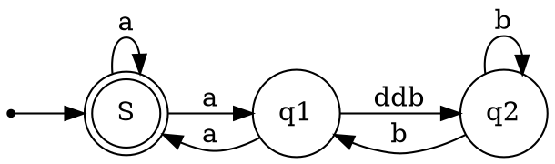

## 教程
{: id="20201220170225-uqmw5bg"}

这是一篇讲解如何正确使用 **Markdown** 的排版示例，学会这个很有必要，能让你的文章有更佳清晰的排版。
{: id="20201220170225-9u2wkk9"}

> 引用文本：Markdown is a text formatting syntax inspired
> {: id="20201220170225-ghxeyi7"}
{: id="20201220170225-53hrfs5"}

## 语法指导
{: id="20201220170225-rkvxx8i"}

### 普通内容
{: id="20201220170225-j0gkt7h"}

这段内容展示了在内容里面一些排版格式，比如：
{: id="20201220170225-tijk966"}

- {: id="20201220170225-z7krlkq"}**加粗** - `**加粗**`
- {: id="20201220170225-d2ndvps"}*倾斜* - `*倾斜*`
- {: id="20201220170225-9qjoieq"}~~删除线~~ - `~~删除线~~`
- {: id="20201220170225-41nap3z"}`Code 标记` - `` `Code 标记` ``
- {: id="20201220170225-hwxxxn4"}[超级链接](https://ld246.com) - `[超级链接](https://ld246.com)`
- {: id="20201220170225-k3smq9u"}[username@gmail.com](mailto:username@gmail.com) - `[username@gmail.com](mailto:username@gmail.com)`
{: id="20201220170225-8jhx0fv"}

### 表情符号 Emoji
{: id="20201220170225-eytsom5"}

支持大部分标准的表情符号，可使用输入法直接输入，也可手动输入字符格式。通过输入 `:` 触发自动完成。
{: id="20201220170225-0fjf7yz"}

#### 一些表情例子
{: id="20201220170225-qir54fd"}

:smile: :laughing: :dizzy_face: :sob: :cold_sweat: :sweat_smile:  :cry: :triumph: :heart_eyes: :relieved::+1: :-1: :100: :clap: :bell: :gift: :question: :bomb: :heart: :coffee: :cyclone: :bow: :kiss: :pray: :anger:
{: id="20201220170225-1b9qtyy"}

### 标题
{: id="20201220170225-141i00g"}

使用一个 `#` 是一级标题，两个 `##` 是二级标题，以此类推，最多支持六级标题。
{: id="20201220170225-vxzpi38"}

> NOTE: 别忘了 # 后面需要有空格！
> {: id="20201220170225-imqb18n"}
{: id="20201220170225-sh9zesn"}

### 图片
{: id="20201220170225-2hyg8or"}

```


```
{: id="20201220170225-byam76t"}

支持直接复制粘贴。
{: id="20201220170225-iawo9tj"}

### 代码块
{: id="20201220170225-1b7m3xn"}

#### 普通
{: id="20201220170225-fwb9gjp"}

```
*emphasize*    **strong**
_emphasize_    __strong__
var a = 1
```
{: id="20201220170225-bfk7v7m"}

#### 语法高亮支持
{: id="20201220170225-hra7dxy"}

如果在 ``` 后面跟随语言名称，可以有语法高亮的效果哦，比如：
{: id="20201220170225-2uwyn7c"}

##### 演示 Go 代码高亮
{: id="20201220170225-3oa5c52"}

```go
package main

import "fmt"

func main() {
	fmt.Println("Hello, 世界")
}
```
{: id="20201220170225-8qf37ue"}

##### 演示 Java 高亮
{: id="20201220170225-rst46wa"}

```java
public class HelloWorld {

    public static void main(String[] args) {
        System.out.println("Hello World!");
    }

}
```
{: id="20201220170225-vb1vw88"}

> Tip: 语言名称支持下面这些： `ruby`, `python`, `js`, `html`, `erb`, `css`, `coffee`, `bash`, `json`, `yml`, `xml` ...
> {: id="20201220170225-f5u7va6"}
{: id="20201220170225-kar7bo1"}

### 有序、无序、任务列表
{: id="20201220170225-hk7d7fc"}

#### 无序列表
{: id="20201220170225-xezcrj5"}

- {: id="20201220170225-pqhetiq"}Java
  {: id="20201220170225-y6gbt5z"}

  - {: id="20201220170225-68xxvt2"}Spring
    - {: id="20201220170225-c82y15n"}IoC
    - {: id="20201220170225-dbs1016"}AOP
    {: id="20201220170225-9vtctak"}
  {: id="20201220170225-ubg2eqc"}
- {: id="20201220170225-lelsylx"}Go
  {: id="20201220170225-ql7esdy"}

  - {: id="20201220170225-0gh21sm"}gofmt
  - {: id="20201220170225-1mdayb3"}Wide
  {: id="20201220170225-dppr7vc"}
- {: id="20201220170225-9hbtqzj"}Node.js
  {: id="20201220170225-bn12o4u"}

  - {: id="20201220170225-zvqpxxx"}Koa
  - {: id="20201220170225-x9hq2zc"}Express
  {: id="20201220170225-3qj7bd9"}
{: id="20201220170225-3uvfqx4"}

#### 有序列表
{: id="20201220170225-l88zcmz"}

1. {: id="20201220170225-7r2aoxp"}Node.js
   {: id="20201220170225-xwmbkbo"}

   1. {: id="20201220170225-y4six5f"}Express
   2. {: id="20201220170225-alpnkdi"}Koa
   3. {: id="20201220170225-zijx7lo"}Sails
   {: id="20201220170225-kuz0bqg"}
2. {: id="20201220170225-vlshue6"}Go
   {: id="20201220170225-jt8jjhx"}

   1. {: id="20201220170225-85nicla"}gofmt
   2. {: id="20201220170225-cdhzbz8"}Wide
   {: id="20201220170225-g41b69e"}
3. {: id="20201220170225-lxtbk92"}Java
   {: id="20201220170225-tzjsum9"}

   1. {: id="20201220170225-muyjq1h"}Latke
   2. {: id="20201220170225-qgm2i12"}IDEA
   {: id="20201220170225-8wsg8vg"}
{: id="20201220170225-xxexvke"}

#### 任务列表
{: id="20201220170225-2utkadn"}

- {: id="20201220170225-x3akbcm"}[X] 发布 Sym
- {: id="20201220170225-608a0hd"}[X] 发布 Solo
- {: id="20201220170225-frmpy30"}[ ] 预约牙医
{: id="20201220170225-kv2t20t"}

### 表格
{: id="20201220170225-8ub6pow"}

如果需要展示数据什么的，可以选择使用表格。
{: id="20201220170225-1goxe5j"}

| header 1 | header 2 |
| ---------- | ---------- |
| cell 1   | cell 2   |
| cell 3   | cell 4   |
| cell 5   | cell 6   |
{: id="20201220170225-kco77ip"}

### 段落
{: id="20201220170225-rqaybon"}

空行可以将内容进行分段，便于阅读。（这是第一段）
{: id="20201220170225-go54x7s"}

使用空行在 Markdown 排版中相当重要。（这是第二段）
{: id="20201220170225-jk3n31o"}

### 链接引用
{: id="20201220170225-tzr6ex8"}

[链接文本][链接标识]
{: id="20201220170225-w6z1wev"}

```
[链接文本][链接标识]

[链接标识]: https://b3log.org
```
{: id="20201220170225-5r0seac"}

### 数学公式
{: id="20201220170225-8isdhof"}

多行公式块：
{: id="20201220170225-ojz9ahq"}

$$
\frac{1}{
  \Bigl(\sqrt{\phi \sqrt{5}}-\phi\Bigr) e^{
  \frac25 \pi}} = 1+\frac{e^{-2\pi}} {1+\frac{e^{-4\pi}} {
    1+\frac{e^{-6\pi}}
    {1+\frac{e^{-8\pi}}{1+\cdots}}
  }
}
$$
{: id="20201220170225-dlg1nga"}

行内公式：
{: id="20201220170225-wq5hdul"}

公式 $a^2 + b^2 = \color{red}c^2$ 是行内。
{: id="20201220170225-p13lixh"}

### 脑图
{: id="20201220170225-pm61uvm"}

```mindmap
- 教程
- 语法指导
  - 普通内容
  - 提及用户
  - 表情符号 Emoji
    - 一些表情例子
  - 大标题 - Heading 3
    - Heading 4
      - Heading 5
        - Heading 6
  - 图片
  - 代码块
    - 普通
    - 语法高亮支持
      - 演示 Go 代码高亮
      - 演示 Java 高亮
  - 有序、无序、任务列表
    - 无序列表
    - 有序列表
    - 任务列表
  - 表格
  - 隐藏细节
  - 段落
  - 链接引用
  - 数学公式
  - 脑图
  - 流程图
  - 时序图
  - 甘特图
  - 图表
  - 五线谱
  - Graphviz
  - 多媒体
  - 脚注
- 快捷键
```
{: id="20201220170225-kdnvnpa"}

### 流程图
{: id="20201220170225-c50a9q8"}


{: id="20201220170225-bgzsekb"}

### 时序图
{: id="20201220170225-hlqu4rh"}


{: id="20201220170225-qw24qjr"}

### 甘特图
{: id="20201220170225-8ymtl09"}


{: id="20201220170225-wx8hyp4"}

### 图表
{: id="20201220170225-9jj0fk4"}

```echarts
{
  "title": { "text": "最近 30 天" },
  "tooltip": { "trigger": "axis", "axisPointer": { "lineStyle": { "width": 0 } } },
  "legend": { "data": ["帖子", "用户", "回帖"] },
  "xAxis": [{
      "type": "category",
      "boundaryGap": false,
      "data": ["2019-05-08","2019-05-09","2019-05-10","2019-05-11","2019-05-12","2019-05-13","2019-05-14","2019-05-15","2019-05-16","2019-05-17","2019-05-18","2019-05-19","2019-05-20","2019-05-21","2019-05-22","2019-05-23","2019-05-24","2019-05-25","2019-05-26","2019-05-27","2019-05-28","2019-05-29","2019-05-30","2019-05-31","2019-06-01","2019-06-02","2019-06-03","2019-06-04","2019-06-05","2019-06-06","2019-06-07"],
      "axisTick": { "show": false },
      "axisLine": { "show": false }
  }],
  "yAxis": [{ "type": "value", "axisTick": { "show": false }, "axisLine": { "show": false }, "splitLine": { "lineStyle": { "color": "rgba(0, 0, 0, .38)", "type": "dashed" } } }],
  "series": [
    {
      "name": "帖子", "type": "line", "smooth": true, "itemStyle": { "color": "#d23f31" }, "areaStyle": { "normal": {} }, "z": 3,
      "data": ["18","14","22","9","7","18","10","12","13","16","6","9","15","15","12","15","8","14","9","10","29","22","14","22","9","10","15","9","9","15","0"]
    },
    {
      "name": "用户", "type": "line", "smooth": true, "itemStyle": { "color": "#f1e05a" }, "areaStyle": { "normal": {} }, "z": 2,
      "data": ["31","33","30","23","16","29","23","37","41","29","16","13","39","23","38","136","89","35","22","50","57","47","36","59","14","23","46","44","51","43","0"]
    },
    {
      "name": "回帖", "type": "line", "smooth": true, "itemStyle": { "color": "#4285f4" }, "areaStyle": { "normal": {} }, "z": 1,
      "data": ["35","42","73","15","43","58","55","35","46","87","36","15","44","76","130","73","50","20","21","54","48","73","60","89","26","27","70","63","55","37","0"]
    }
  ]
}
```
{: id="20201220170225-p4g1whd"}

### 五线谱
{: id="20201220170225-ch2melo"}

```abc
X: 24
T: Clouds Thicken
C: Paul Rosen
S: Copyright 2005, Paul Rosen
M: 6/8
L: 1/8
Q: 3/8=116
R: Creepy Jig
K: Em
|:"Em"EEE E2G|"C7"_B2A G2F|"Em"EEE E2G|\
"C7"_B2A "B7"=B3|"Em"EEE E2G|
"C7"_B2A G2F|"Em"GFE "D (Bm7)"F2D|\
1"Em"E3-E3:|2"Em"E3-E2B|:"Em"e2e gfe|
"G"g2ab3|"Em"gfeg2e|"D"fedB2A|"Em"e2e gfe|\
"G"g2ab3|"Em"gfe"D"f2d|"Em"e3-e3:|
```
{: id="20201220170225-yps8npr"}

### Graphviz
{: id="20201220170225-ot7htb2"}


{: id="20201220170225-ykccrji"}

### Flowchart
{: id="20201220170225-sj1y570"}

```flowchart
st=>start: Start
op=>operation: Your Operation
cond=>condition: Yes or No?
e=>end

st->op->cond
cond(yes)->e
cond(no)->op
```
{: id="20201220170225-2fk9yhq"}

### 内容块
{: id="20201220170225-h5hnb4e"}

内容块相关语法是思源笔记对 Markdown 进行的扩展。
{: id="20201220170225-oo5t8jw"}

#### 内容块引用
{: id="20201220170225-ppd3gty"}

`((20200817123136-in6y5m1 "内容块引用"))`
{: id="20201220170225-nswpvnp"}

((20200817123136-in6y5m1 "内容块引用"))
{: id="20201220170225-juzt6v9"}

#### 内容块嵌入
{: id="20201220170225-b9nrunq"}

`!((20200920190726-xw7fial​ "内容块嵌入"))`
{: id="20201220170225-d0dozkn"}

!((20200920190726-xw7fial "内容块嵌入"))

{: id="20201220171546-e8h890p" type="doc"}

{: id="20201220170225-852oir7"}

#### 超级块
{: id="20201220170225-g2o1q1h"}

```markdown
{{{
内容块
……
}}}
```
{: id="20201220170225-eno7t6e"}

## 快捷键
{: id="20201220170225-1qkzvq0"}

我们的编辑器支持很多快捷键，具体请参考((20200813004551-gm0pbn1 "编辑器和快捷键"))。
{: id="20201220170225-cdq65tp"}


{: id="20200825162036-4dx365o" type="doc"}
