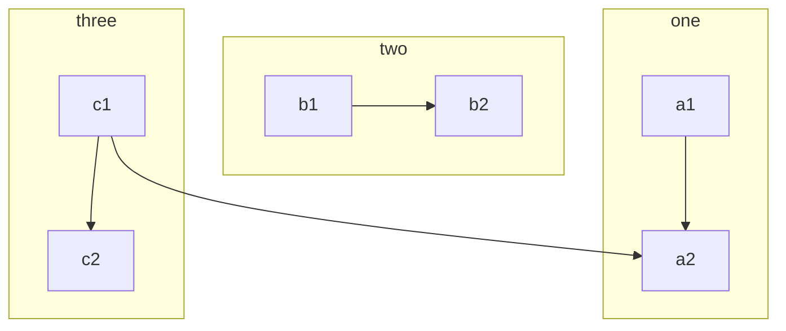
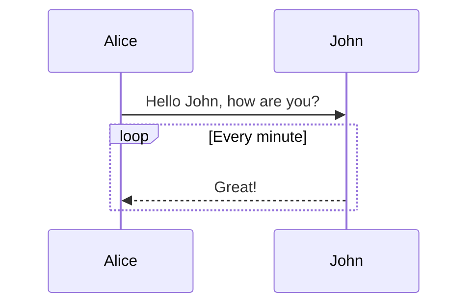
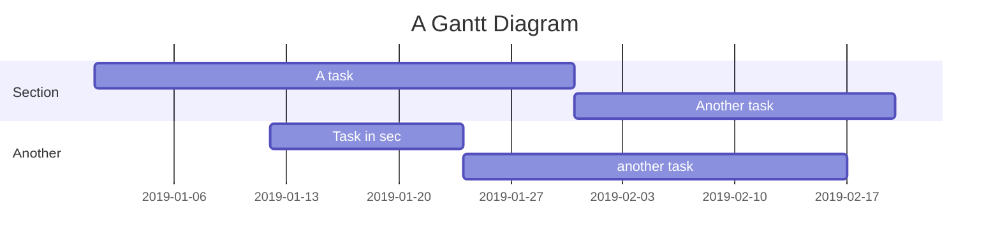
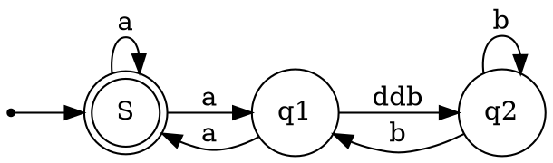
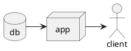

## 加粗、斜体和超链接
{: id="20210104091228-r6i8p26" updated="20210415200747"}

- {: id="20210104091228-g3o4hqx"}**加粗** - `**加粗**`
  {: id="20210201202130-k5ntwkh"}
- {: id="20210104091228-l1f9s95"}*倾斜* - `*倾斜*`
  {: id="20210201202130-c2njrpx"}
- {: id="20210104091228-amby2nd"}~~删除线~~ - `~~删除线~~`
  {: id="20210201202130-5gjedzr"}
- {: id="20210104091228-wfw8egv"}`Code 标记` - `` `Code 标记` ``
  {: id="20210201202130-085324n"}
- {: id="20210104091228-56d6mjx"}[超级链接](https://ld246.com) - `[超级链接](https://ld246.com)`
  {: id="20210201202130-jhxwimm"}
- {: id="20210104091228-9gixvmv"}[username@gmail.com](mailto:username@gmail.com) - `[username@gmail.com](mailto:username@gmail.com)`
  {: id="20210201202130-loi1r5h"}
{: id="20210104091228-ttcj9nm"}

## 表情符号 Emoji
{: id="20210104091228-qc254sc" updated="20210415200513"}

支持大部分标准的表情符号，可使用输入法直接输入，也可手动输入字符格式。通过输入 `:` 触发自动完成。
{: id="20210104091228-5u3bvj2" updated="20210415200801"}

:smile: :laughing: :dizzy_face: :sob: :cold_sweat: :sweat_smile:  :cry: :triumph: :heart_eyes: :relieved::+1: :-1: :100: :clap: :bell: :gift: :question: :bomb: :heart: :coffee: :cyclone: :bow: :kiss: :pray: :anger:
{: id="20210104091228-v4e2xl6"}

## 标题
{: id="20210104091228-ukgboyj" updated="20210415200516"}

使用一个 `#` 是一级标题，两个 `##` 是二级标题，以此类推，最多支持六级标题。
{: id="20210104091228-d0rzbmm"}

> NOTE: 别忘了 # 后面需要有空格！
> {: id="20210104091228-qxlf274"}
{: id="20210104091228-2z0x8zn"}

## 图片
{: id="20210104091228-lft5b4z" updated="20210415200519"}

```


```
{: id="20210104091228-mrn0ben"}

支持直接复制粘贴。
{: id="20210104091228-o6sn1eo"}

## 代码块
{: id="20210104091228-r7b56f9" updated="20210415200520"}

### 普通
{: id="20210104091228-u3qexi8" updated="20210415200522"}

```
*emphasize*    **strong**
_emphasize_    __strong__
var a = 1
```
{: id="20210104091228-xobeoa2"}

### 语法高亮支持
{: id="20210104091228-y26sx72" updated="20210415200525"}

如果在 ``` 后面跟随语言名称，可以有语法高亮的效果哦，比如：
{: id="20210104091228-zbx0a7k"}

#### 演示 Go 代码高亮
{: id="20210104091228-qagtclt" updated="20210415200529"}

```go
package main

import "fmt"

func main() {
	fmt.Println("Hello, 世界")
}
```
{: id="20210104091228-mwb2x54"}

#### 演示 Java 高亮
{: id="20210104091228-cwrynj4" updated="20210415200530"}

```java
public class HelloWorld {

    public static void main(String[] args) {
        System.out.println("Hello World!");
    }

}
```
{: id="20210104091228-68vvd95"}

> Tip: 语言名称支持下面这些： `ruby`, `python`, `js`, `html`, `erb`, `css`, `coffee`, `bash`, `json`, `yml`, `xml` ...
> {: id="20210104091228-rdwfiml"}
{: id="20210104091228-zphf09i"}

## 有序、无序、任务列表
{: id="20210104091228-okx8vv6" updated="20210415200532"}

### 无序列表
{: id="20210104091228-y6h31l2" updated="20210415200534"}

- {: id="20210104091228-ao01ihn"}Java
  {: id="20210104091228-khhcxxb"}

  - {: id="20210104091228-f1fuuw8"}Spring
    {: id="20210201202130-qygmjtz"}

    - {: id="20210104091228-59tiycd"}IoC
      {: id="20210201202130-l16qucu"}
    - {: id="20210104091228-0wokn6i"}AOP
      {: id="20210201202130-ygstwe6"}
    {: id="20210104091228-stoibku"}
  {: id="20210104091228-2tvase5"}
- {: id="20210104091228-uwgbo4t"}Go
  {: id="20210104091228-4iaruia"}

  - {: id="20210104091228-vkb7enf"}gofmt
    {: id="20210201202130-rzlpkkj"}
  - {: id="20210104091228-uqjuw2o"}Wide
    {: id="20210201202130-qch6yqa"}
  {: id="20210104091228-4myaos9"}
- {: id="20210104091228-7flk3zm"}Node.js
  {: id="20210104091228-uf9qzs2"}

  - {: id="20210104091228-8lpmuec"}Koa
    {: id="20210201202130-gk2oada"}
  - {: id="20210104091228-vntkz6f"}Express
    {: id="20210201202130-c8xufv4"}
  {: id="20210104091228-eqn6zno"}
{: id="20210104091228-tue1zbn"}

### 有序列表
{: id="20210104091228-ocbok50" updated="20210415200535"}

1. {: id="20210104091228-2wye0q8"}Node.js
   {: id="20210104091228-gh3iahw"}

   1. {: id="20210104091228-2hep2d7"}Express
      {: id="20210201202130-qt11hok"}
   2. {: id="20210104091228-rhye36o"}Koa
      {: id="20210201202130-bf68t5m"}
   3. {: id="20210104091228-h47hx81"}Sails
      {: id="20210201202130-qazevx1"}
   {: id="20210104091228-7sawqgy"}
2. {: id="20210104091228-29gr849"}Go
   {: id="20210104091228-wfqvbsy"}

   1. {: id="20210104091228-z73aib0"}gofmt
      {: id="20210201202130-1dj6nbe"}
   2. {: id="20210104091228-39nit6d"}Wide
      {: id="20210201202130-bpzv6xh"}
   {: id="20210104091228-wxhct3e"}
3. {: id="20210104091228-ucegi2v"}Java
   {: id="20210104091228-yf36zhd"}

   1. {: id="20210104091228-tvqmxn9"}Latke
      {: id="20210201202130-ei0tma8"}
   2. {: id="20210104091228-du6vwoz"}IDEA
      {: id="20210201202130-ss7iso3"}
   {: id="20210104091228-lzi6i54"}
{: id="20210104091228-90lv391"}

### 任务列表
{: id="20210104091228-t9yutg4" updated="20210415200538"}

- {: id="20210104091228-670n64p"}[X] 发布 Sym
  {: id="20210201202130-ns9nysj"}
- {: id="20210104091228-emgg0f6"}[X] 发布 Solo
  {: id="20210201202130-jhil31u"}
- {: id="20210104091228-yfsyoad"}[ ] 预约牙医
  {: id="20210201202130-w23kkwd"}
{: id="20210104091228-4uwvws7"}

## 表格
{: id="20210104091228-1bq55o9" updated="20210415200539"}

如果需要展示数据什么的，可以选择使用表格。
{: id="20210104091228-gbwwyx8"}

| header 1 | header 2 |
| ---------- | ---------- |
| cell 1   | cell 2   |
| cell 3   | cell 4   |
| cell 5   | cell 6   |
{: id="20210104091228-eem86ni"}

## 段落
{: id="20210104091228-a5rr708" updated="20210415200541"}

空行可以将内容进行分段，便于阅读。（这是第一段）
{: id="20210104091228-uhuylde"}

使用空行在 Markdown 排版中相当重要。（这是第二段）
{: id="20210104091228-i5me76e"}

## 链接引用
{: id="20210104091228-l1vtpul" updated="20210415200543"}

[链接文本][链接标识]
{: id="20210104091228-lyyb2lu"}

```
[链接文本][链接标识]

[链接标识]: https://b3log.org
```
{: id="20210104091228-cts10x6"}

## 数学公式
{: id="20210104091228-l7g1s3j" updated="20210415200550"}

多行公式块：
{: id="20210104091228-otkwftt"}

$$
\frac{1}{
  \Bigl(\sqrt{\phi \sqrt{5}}-\phi\Bigr) e^{
  \frac25 \pi}} = 1+\frac{e^{-2\pi}} {1+\frac{e^{-4\pi}} {
    1+\frac{e^{-6\pi}}
    {1+\frac{e^{-8\pi}}{1+\cdots}}
  }
}
$$
{: id="20210104091228-9ok9gv4"}

行内公式：
{: id="20210104091228-uykm5py"}

公式 $a^2 + b^2 = \color{red}c^2$ 是行内。
{: id="20210104091228-24iycni"}

## 脑图
{: id="20210104091228-wdpx6ev" updated="20210415200555"}

```mindmap
- 教程
- 语法指导
  - 普通内容
  - 提及用户
  - 表情符号 Emoji
    - 一些表情例子
  - 大标题 - Heading 3
    - Heading 4
      - Heading 5
        - Heading 6
  - 图片
  - 代码块
    - 普通
    - 语法高亮支持
      - 演示 Go 代码高亮
      - 演示 Java 高亮
  - 有序、无序、任务列表
    - 无序列表
    - 有序列表
    - 任务列表
  - 表格
  - 隐藏细节
  - 段落
  - 链接引用
  - 数学公式
  - 脑图
  - 流程图
  - 时序图
  - 甘特图
  - 图表
  - 五线谱
  - Graphviz
  - 多媒体
  - 脚注
- 快捷键
```
{: id="20210104091228-xdtxrto"}

## 流程图
{: id="20210104091228-2nz4ows" updated="20210415200557"}


{: id="20210104091228-ez3uzqu"}

## 时序图
{: id="20210104091228-jlr83td" updated="20210415200558"}


{: id="20210104091228-jf7ocds"}

## 甘特图
{: id="20210104091228-bp25efl" updated="20210415200600"}


{: id="20210104091228-rkz14tq"}

## 图表
{: id="20210104091228-jctx529" updated="20210415200602"}

```echarts
{
  "title": { "text": "最近 30 天" },
  "tooltip": { "trigger": "axis", "axisPointer": { "lineStyle": { "width": 0 } } },
  "legend": { "data": ["帖子", "用户", "回帖"] },
  "xAxis": [{
      "type": "category",
      "boundaryGap": false,
      "data": ["2019-05-08","2019-05-09","2019-05-10","2019-05-11","2019-05-12","2019-05-13","2019-05-14","2019-05-15","2019-05-16","2019-05-17","2019-05-18","2019-05-19","2019-05-20","2019-05-21","2019-05-22","2019-05-23","2019-05-24","2019-05-25","2019-05-26","2019-05-27","2019-05-28","2019-05-29","2019-05-30","2019-05-31","2019-06-01","2019-06-02","2019-06-03","2019-06-04","2019-06-05","2019-06-06","2019-06-07"],
      "axisTick": { "show": false },
      "axisLine": { "show": false }
  }],
  "yAxis": [{ "type": "value", "axisTick": { "show": false }, "axisLine": { "show": false }, "splitLine": { "lineStyle": { "color": "rgba(0, 0, 0, .38)", "type": "dashed" } } }],
  "series": [
    {
      "name": "帖子", "type": "line", "smooth": true, "itemStyle": { "color": "#d23f31" }, "areaStyle": { "normal": {} }, "z": 3,
      "data": ["18","14","22","9","7","18","10","12","13","16","6","9","15","15","12","15","8","14","9","10","29","22","14","22","9","10","15","9","9","15","0"]
    },
    {
      "name": "用户", "type": "line", "smooth": true, "itemStyle": { "color": "#f1e05a" }, "areaStyle": { "normal": {} }, "z": 2,
      "data": ["31","33","30","23","16","29","23","37","41","29","16","13","39","23","38","136","89","35","22","50","57","47","36","59","14","23","46","44","51","43","0"]
    },
    {
      "name": "回帖", "type": "line", "smooth": true, "itemStyle": { "color": "#4285f4" }, "areaStyle": { "normal": {} }, "z": 1,
      "data": ["35","42","73","15","43","58","55","35","46","87","36","15","44","76","130","73","50","20","21","54","48","73","60","89","26","27","70","63","55","37","0"]
    }
  ]
}
```
{: id="20210104091228-b6sr6sq"}

## 五线谱
{: id="20210104091228-nxyj563" updated="20210415200605"}

```abc
X: 24
T: Clouds Thicken
C: Paul Rosen
S: Copyright 2005, Paul Rosen
M: 6/8
L: 1/8
Q: 3/8=116
R: Creepy Jig
K: Em
|:"Em"EEE E2G|"C7"_B2A G2F|"Em"EEE E2G|\
"C7"_B2A "B7"=B3|"Em"EEE E2G|
"C7"_B2A G2F|"Em"GFE "D (Bm7)"F2D|\
1"Em"E3-E3:|2"Em"E3-E2B|:"Em"e2e gfe|
"G"g2ab3|"Em"gfeg2e|"D"fedB2A|"Em"e2e gfe|\
"G"g2ab3|"Em"gfe"D"f2d|"Em"e3-e3:|
```
{: id="20210104091228-0oun8c9"}

## Graphviz
{: id="20210104091228-ifv0j64" updated="20210415200607"}


{: id="20210104091228-ww5nb3p"}

## Flowchart
{: id="20210104091228-tw1nmmg" updated="20210415200608"}

```flowchart
st=>start: Start
op=>operation: Your Operation
cond=>condition: Yes or No?
e=>end

st->op->cond
cond(yes)->e
cond(no)->op
```
{: id="20210104091228-mh7dtd0"}

## PlantUML
{: id="20210201202204-gljrabr" updated="20210415200621"}


{: id="20210201202302-5lfweuz"}


{: id="20200825162036-4dx365o" type="doc"}
